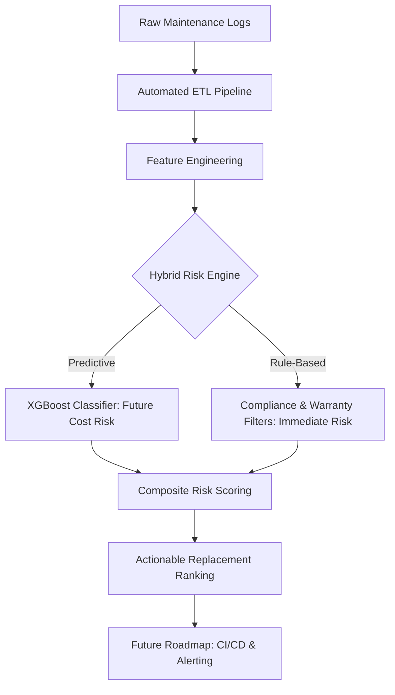

# 👁️ Smart-ITAM-Analytics: Hybrid Risk Scoring & ML Pipeline

A hybrid IT asset risk analytics system that combines rule-based operational alerts with machine learning-based replacement risk scoring. This project builds an **end-to-end pipeline** from raw maintenance logs to predictive decision support, enabling proactive IT asset management.

---

## 📌 Inspiration & Background (The Dcard Experience)

This project was inspired by my experience as an IT MIS intern at **Dcard**, where I managed over 2,000 hardware assets and executed a **full-scale physical re-audit following disaster recovery efforts**. 

I observed that IT operations are often highly **reactive** — assets are only replaced after failure or when maintenance costs peak. This project bridges IT infrastructure and data science to develop a **hybrid system** that detects immediate operational risks and predicts future replacement needs.

---

## 🎯 Project Objectives

- **Operational Safety**: Identify assets requiring immediate attention via rule-based filters.
- **Cost Prediction**: Use Machine Learning to identify "High-Cost" assets (Top 25% maintenance expenses).
- **Strategic Planning**: Generate a **Composite Risk Score** to prioritize budget allocation.

---

## 🏗️ System Architecture

---

## ⚠️ Rule-Based Risk Detection

To capture urgent operational risks that require manual intervention:

### 📌 Selection Criteria
- **Non-Compliant Assets**: Devices failing security or OS standards (e.g., outdated patches).
- **Warranty Expiry**: Assets with warranties expiring within **90 days**.

### 📊 Practical Value
This reflects real-world IT workflows where compliance and hardware support status dictate immediate replacement cycles, regardless of predicted costs.

---

## 🤖 Machine Learning & Target Formulation

### 1. Target Definition: Why "High-Cost"?
- **Label**: `Is_High_Cost = 1` if total maintenance expense falls within the **Top 25% (Upper Quartile)**.
- **Strategy**: Predicting exact dollar amounts is often volatile due to random repair events. Classifying assets into **Risk Tiers** provides a more stable and actionable signal for procurement planning.

### 2. Model Optimization (Handling Imbalance)
To address the 3:1 data imbalance (Normal vs. High-Cost), I implemented **Cost-Sensitive Learning (`scale_pos_weight = 3`)**:
- **Trade-off**: I deliberately sacrificed **3% of overall Accuracy** to achieve a **42% increase in Recall (0.71)**.
- **Why?**: In ITAM, a **"False Negative"** (missing a failing device) is far more expensive than a **"False Positive"** (inspecting a healthy one).

### 3. Feature Engineering
- **Asset_Age**: Years since purchase.
- **Repair_Intensity**: `Total Repair Count / Asset Age`.
- **Compliance_Score**: Categorical encoding of asset health.
- **Categorical Data**: `Asset_Type`, `Department`, `Warranty_Status`.

---

## 📊 Data-Driven Insights (EDA)

Findings from `eda_visualization.ipynb` that shaped the final model:
- **Cost Driver**: Non-compliant assets contribute to approximately **$616k** in total maintenance costs, significantly higher than compliant ones.
- **Correlation**: `Repair_Count` shows a moderate correlation (~0.47) with cost, making it a strong predictor for the ML model.
- **Asset Health**: Laptops and Servers in the "At Risk" category represent the highest concentration of potential savings through proactive replacement.

---

## ⚙️ Replacement Risk Scoring

To provide a single source of truth for IT managers, we calculate a **Composite Risk Score (0.0 - 1.0)**:

$$\text{Risk Score} = 0.4(P_{ML}) + 0.2(\text{Age}_{norm}) + 0.2(\text{Repairs}_{norm}) + 0.2(\text{Warranty}_{exp})$$

| Component | Weight | Significance |
| :--- | :--- | :--- |
| **ML Probability (P_ML)** | **40%** | Captures non-linear failure patterns and hidden risks identified by XGBoost. |
| **Asset Age (Age)** | **20%** | Accounts for the physical law of hardware depreciation and mechanical aging. |
| **Repair Intensity** | **20%** | Reflects historical reliability; frequent repairs indicate a "Lemon" asset. |
| **Warranty Status** | **20%** | Represents financial risk; expired warranties lead to 100% out-of-pocket costs. |

| Score Range | Risk Level | Action Recommended |
| :--- | :--- | :--- |
| **0.0 – 0.4** | **Low** | Routine Maintenance |
| **0.4 – 0.7** | **Medium** | Monitor & Budget for Next Year |
| **0.7 – 1.0** | **High** | **Immediate Replacement Planning** |

---

## 💼 Business Impact

- **From Reactive to Proactive**: Reduces "firefighting" by predicting failures before they occur.
- **Budget Optimization**: Scientific justification for hardware procurement based on cost-risk ROI.
- **Compliance Security**: Integrates IT security (compliance) directly into the asset lifecycle.

---

## 🛠 Tech Stack & Structure

- **Languages**: Python (Pandas, NumPy)
- **Machine Learning**: XGBoost (Cost-Sensitive Learning), Scikit-learn
- **Visualization**: Matplotlib, Seaborn
- **Data Engineering**: SQL, ETL Pipelines

- **Project Structure**:  
.
├── data/
│   ├── raw_it_assets.csv          # Original maintenance logs
│   ├── processed_it_assets.csv    # Cleaned data after ETL
│   └── final_risk_assessment.csv  # Output with Risk Scores & Levels
├── notebooks/
│   ├── data_cleaning_ETL.ipynb    # Preprocessing & Feature Engineering
│   ├── eda_visualization.ipynb    # Statistical & Cost Analysis
│   └── predictive_model.ipynb     # XGBoost & Scoring Engine
├── .gitignore                     # To exclude .venv and large data files
└── README.md

---

## 🚀 Future Roadmap: CI/CD & Automated Alerting

- [ ] **Data CI/CD & Alerting**: Integrate **GitHub Actions** to automate daily scoring and trigger **Slack/Email alerts** when an asset's risk escalates.
- [ ] **Risk Escalation Detection (Delta)**: Develop a monitoring module that compares T vs T-1 risk scores to identify assets jumping from "Medium" to "High" risk levels.
- [ ] **Time-Series Integration**: Forecast specific month-of-failure for server-grade hardware.
- [ ] **Interactive Dashboard**: Build a Streamlit UI for real-time risk exploration.

---

### 📝 Final Note
This project demonstrates the ability to translate technical data science workflows into **practical IT solutions**, grounded in the reality of managing large-scale enterprise infrastructure.