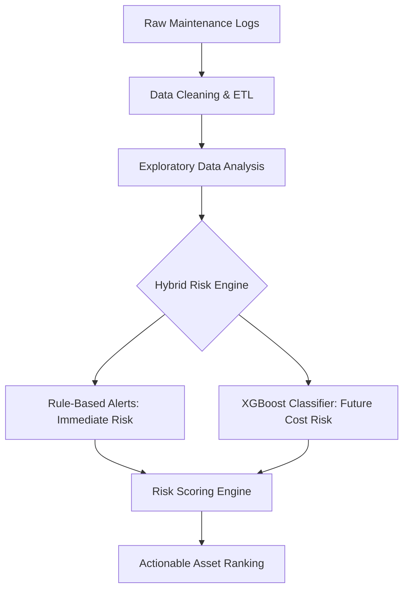

# 👁️ Smart-ITAM-Analytics

A hybrid IT asset risk analytics system that combines rule-based operational alerts with machine learning-based replacement risk scoring.

This project builds an **end-to-end pipeline** from raw maintenance logs to predictive decision support, enabling proactive IT asset management.

---

## 📌 Introduction

This project was inspired by my experience in IT asset management during my internship at **Dcard**, where I managed over 2,000 hardware assets and conducted a full-scale physical re-audit following disaster recovery efforts. 

I observed that IT operations are often highly **reactive** — assets are replaced only after failure or when maintenance costs peak. This project bridges IT infrastructure and data science to develop a **hybrid system** that detects immediate operational risks and predicts future replacement needs.

---

## 🎯 Project Objectives

- **Operational Safety**: Identify assets requiring immediate attention via rule-based filters.
- **Cost Prediction**: Use Machine Learning to identify "High-Cost" assets (Top 25% maintenance expenses).
- **Strategic Planning**: Generate a **Composite Risk Score** to prioritize budget allocation.

---

## 🏗️ System Architecture

---

## ⚠️ Rule-Based Risk Detection

To capture urgent operational risks that require manual intervention:

### 📌 Selection Criteria
- **Non-Compliant Assets**: Devices failing security or OS standards.
- **Warranty Expiry**: Assets with warranties expiring within **90 days**.

### 📊 Practical Value
This reflects real-world IT workflows where compliance and hardware support status dictate immediate replacement cycles.

---

## 🤖 Machine Learning Model

### 🎯 Target Formulation
We define the problem as a **Binary Classification task**:
- **Target**: `Is_High_Cost = 1` if `Maintenance_Cost` is in the **Top 25%**.
- **Reasoning**: Predicting exact dollar amounts in maintenance is often volatile; predicting "Risk Tiers" provides more stable and actionable insights for decision-makers.

### 📌 Feature Engineering
- **Asset_Age**: Years since purchase.
- **Repair_Intensity**: (Total Repair Count / Asset Age).
- **Compliance_Score**: Categorical encoding of asset health.
- **Categorical Data**: Asset_Type, Department, Warranty_Status.

---

## 📊 Data-Driven Insights (EDA)

Based on the analysis in `eda_visualization.ipynb`:
- **Cost Driver**: Non-compliant assets contribute to approximately **$616k** in total maintenance costs, significantly higher than compliant ones.
- **Correlation**: `Repair_Count` shows a moderate correlation (~0.47) with cost, making it a strong predictor for the ML model.
- **Asset Health**: Laptops and Servers in the "At Risk" category represent the highest concentration of potential savings through proactive replacement.

---

## ⚙️ Replacement Risk Scoring

To provide a single source of truth for IT managers, we calculate a **Composite Risk Score (0.0 - 1.0)**:

$$\text{Risk Score} = 0.4(P_{ML}) + 0.2(\text{Age}_{norm}) + 0.2(\text{Repairs}_{norm}) + 0.2(\text{Warranty}_{exp})$$

| Score Range | Risk Level | Action Recommended |
| :--- | :--- | :--- |
| **0.0 – 0.4** | **Low** | Routine Maintenance |
| **0.4 – 0.7** | **Medium** | Monitor & Budget for Next Year |
| **0.7 – 1.0** | **High** | **Immediate Replacement Planning** |

---

## 💼 Business Impact

- **From Reactive to Proactive**: Reduces "firefighting" by predicting failures before they occur.
- **Budget Optimization**: Scientific justification for hardware procurement based on cost-risk ROI.
- **Compliance Security**: Integrates IT security (compliance) directly into the asset lifecycle.

---

## 🛠 Tech Stack

- **Languages**: Python (Pandas, NumPy)
- **ML Frameworks**: XGBoost, Scikit-learn
- **Visualization**: Matplotlib, Seaborn
- **Data Engineering**: SQL, ETL Pipelines

---

## 🚀 Future Roadmap

- [ ] **Time-Series Integration**: Forecast specific month-of-failure for server-grade hardware.
- [ ] **Interactive Dashboard**: Build a Streamlit UI for real-time risk exploration.
- [ ] **Cloud Deployment**: Automate ETL using AWS Glue or GitHub Actions.

---

### 📝 Final Note
This project demonstrates the ability to translate technical data science workflows into **practical IT solutions**, grounded in the reality of managing large-scale enterprise infrastructure.